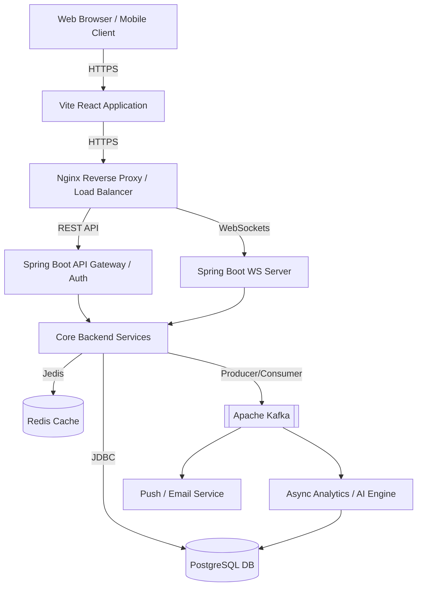

# System Architecture

The CryptoVaultX platform follows a standard 3-tier microservice-ready architecture.

## Security Layer
1. **Edge**: Nginx handles SSL termination and routing.
2. **Gateway**: `RateLimitingFilter` (Bucket4j) protects sensitive paths like `/api/auth/` (20 req/min).
3. **Application**: `JwtAuthenticationFilter` validates stateless JWTs and parses `ROLE_USER` / `ROLE_ADMIN` authorities.
