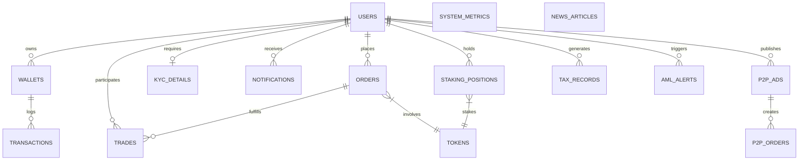

# PostgreSQL Entity-Relationship Diagram

```mermaid
erDiagram
    USERS ||--o{ WALLETS : owns
    USERS ||--o{ ORDERS : places
    USERS ||--o{ TRADES : participates
    USERS ||--o| KYC_DETAILS : requires
    USERS ||--o{ NOTIFICATIONS : receives
    
    WALLETS ||--o{ TRANSACTIONS : logs
    
    ORDERS ||--o{ TRADES : fulfills
    ORDERS }|--|| TOKENS : involves
    
    P2P_ADS ||--o{ P2P_ORDERS : creates
    USERS ||--o{ P2P_ADS : publishes
    
    USERS ||--o{ STAKING_POSITIONS : holds
    STAKING_POSITIONS }|--|| TOKENS : stakes
    
    USERS ||--o{ TAX_RECORDS : generates
    
    USERS ||--o{ AML_ALERTS : triggers
    
    SYSTEM_METRICS
    NEWS_ARTICLES
```
