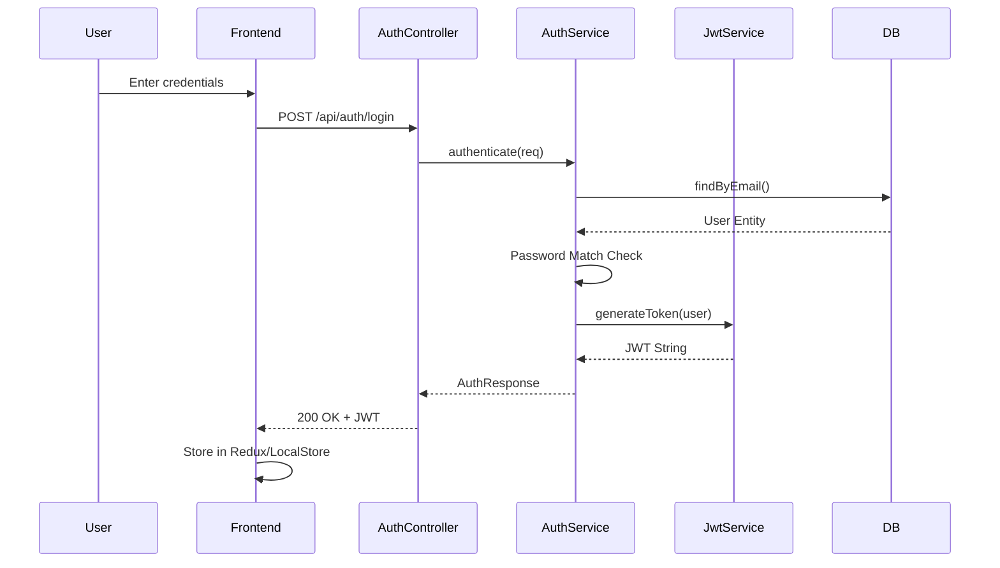
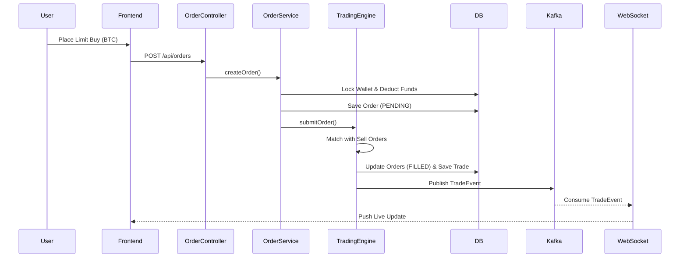

# Sequence Diagrams

## 1. Authentication Flow

```mermaid
sequenceDiagram
    participant User
    participant Frontend
    participant AuthController
    participant AuthService
    participant JwtService
    participant DB

    User->>Frontend: Enter credentials
    Frontend->>AuthController: POST /api/auth/login
    AuthController->>AuthService: authenticate(req)
    AuthService->>DB: findByEmail()
    DB-->>AuthService: User Entity
    AuthService->>AuthService: Password Match Check
    AuthService->>JwtService: generateToken(user)
    JwtService-->>AuthService: JWT String
    AuthService-->>AuthController: AuthResponse
    AuthController-->>Frontend: 200 OK + JWT
    Frontend->>Frontend: Store in Redux/LocalStore
```

## 2. Order Matching Flow

```mermaid
sequenceDiagram
    participant User
    participant Frontend
    participant OrderController
    participant OrderService
    participant TradingEngine
    participant DB
    participant Kafka
    participant WebSocket

    User->>Frontend: Place Limit Buy (BTC)
    Frontend->>OrderController: POST /api/orders
    OrderController->>OrderService: createOrder()
    OrderService->>DB: Lock Wallet & Deduct Funds
    OrderService->>DB: Save Order (PENDING)
    OrderService->>TradingEngine: submitOrder()
    TradingEngine->>TradingEngine: Match with Sell Orders
    TradingEngine->>DB: Update Orders (FILLED) & Save Trade
    TradingEngine->>Kafka: Publish TradeEvent
    Kafka-->>WebSocket: Consume TradeEvent
    WebSocket-->>Frontend: Push Live Update
```
